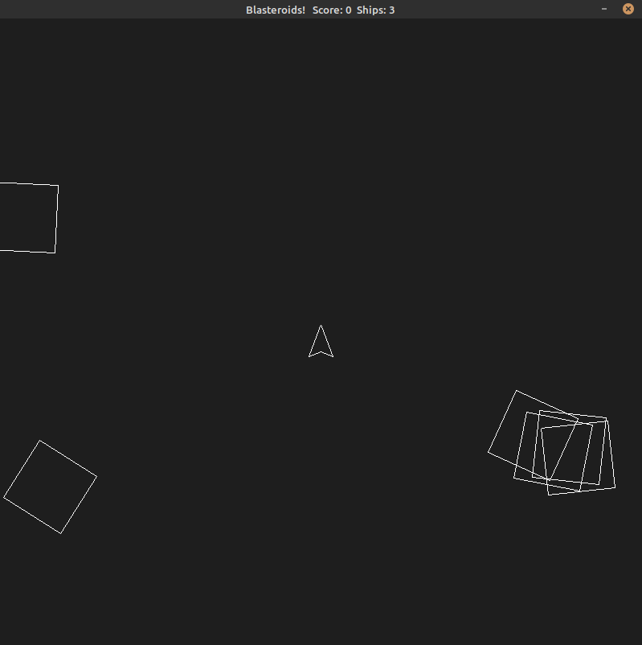

# CPPND: Capstone Game: Blasteroids

## Project Description

This is my Capstone Project for the [Udacity C++ Nanodegree Program](https://www.udacity.com/course/c-plus-plus-nanodegree--nd213).  It's an asteroids clone built with SDL2, and was extended from starter code provided by the course, which was inspired by the snake game in [this](https://codereview.stackexchange.com/questions/212296/snake-game-in-c-with-sdl) excellent StackOverflow post and set of responses.

In this Capstone Project, we could choose our own C++ application or extend a Snake game example, following principles we've learned throughout the Nanodegree Program.  I chose to extent the Snake game and adapted it to build this asteroids clone.  The purpose of the project is to demonstrate our ability to independently create applications using a wide range of C++ features. 

The description below includes a description of meeting Rubric requirements including 7 specific examples in the code.

At the bottom of this README, you can find instructions for compiling and running the project on your own machine.



  ## Gameplay

  ### Controls:
  - Right and Left arrows to rotate ship
  - Up arrow for thrust
  - Spacebar to fire
  
  ### Basic Game Settings:
  (many settings can be found in src/settings.h)
  - First round starts with 5 large asteroids
  - Destroy all asteroids to move to next round
  - Blasting a large asteroid breaks it into two medium asteroids, hitting a medium breaks it into two small, and hitting a small destroys it.
  - A collision between a ship and an asteroid destroys the ship, but not the asteroid.
  - Clear the board and start a new round (each round adds an additional asteroid for difficulty)
  - Scoring is 10 points for large asteroids, 20 for medium and 40 for small
  - You have three ships, once all three have been destroyed, game is over and you may play again.

## Code Organization
The code is contained in one directory (`/src`). 

The `/src` directory includes a `main.cpp` file which is the entry point into the application and instantiates the `Game`, `Controller` and `Renderer` objects before calling the methods to begin running the game.

The `/src` directory also includes header and .cpp files for each of the objects used in the game.  The `Game`, `Controller` and `Renderer` classes provide the infrasctucture for running the game, monitoring the keyboard for user input and rendering the game to the display using SDL2.  For the objects that appear within the game, I have added the `Polygon` class as a base class, and the `Asteroid`, `Ship` and `Shot` classes which are derived classes.  There are also `Announcement` and `Explosion` classes in this directory which are not derived from Polygon but which are used in the game.

Finally, the `/src` directory includes a `settings.h` file with many settings used in the game (centralized here in this file for ease of making changes to these settings), and a `utilities.h` file for purposes of utility functions not specifically attached to one class, but for use among different classes (currently it only contains a function for changing a number representing degrees in a circle into a number representating radians).

In addition to these code files, there is a font file located in the `/assets` directory for the Sans font which is utilized by the game.

The repository also provides a `CMakeLists.txt` file with the cmake instructions to build the make file, as well as a folder `/cmake` directory which is used by these instructions to locate and use the relevant parts of certain specialized libraries upon which the game relies (e.g., SDL2_gfx and SDL2_TTF).

### Examples in the Code of Rubric requirements:

### Loops, Functions, I/O
  **Rubric Requirement: Functions and Control Structures**

  The primary example of a loop in this project (as in any game) is the game loop, which circulates through a controller check, an update of all objects and relevant variables of the Game object, and finally a render function to render the updated objects to the display.  Additionally I have relied upon a variety of control stuctured (including for and while loops) within the Update and Render functions.

  For example, game.cpp includes the following for loops (beginning at line 99) to iterate through the vectors of asteroids and shots in order to call each one's Update() method:

  ```
  // update asteroids
  for (auto &asteroid: asteroids) {
    updateThreads.emplace_back(std::thread(&Asteroid::Update, asteroid.get()));
  }

  // update shots
  if (ship && status == Game::Status::Playing) {
    updateThreads.emplace_back(std::thread(&Ship::Update, ship.get()));
  }

  // update shots
  for (auto &shot: shots) {
    if (shot->IsActive()) {
      updateThreads.emplace_back(std::thread(&Shot::Update, shot.get()));
    }
  }
  ```

  further down in the same Update() member method (beginning at line 169), there is a nested loop of asteroids and shots to conduct a collision check and add any asteroids which have been hit by a shot to a list of "blastedAsteroids" for later processing: 

  ```
    // Collision checks:
  std::vector<int> blastedAsteroidIds; // empty vector to track hit asteroids

  for (auto &asteroid : asteroids) {
    for (auto &shot: shots) {
      if (shot->IsActive() && shot->IsColliding(*asteroid)) {
        shot->Deactivate();
        blastedAsteroidIds.push_back(asteroid->GetId());
      }
    }

    
    if (ship && ship->IsColliding(*asteroid)) {
      shipsRemaining--;
      status = Game::Status::Explosion;
      explosion = std::make_shared<Explosion>(ship->GetCenter(), ship->GetRotation());
      ship.reset();
    }
  }
  ```

  There are many other uses of for loops throughout the program, including in the Draw() method of the Polygon class, which loops through the _vertices vector for the Polygon in order to both construct the Polygon and store their current edges in the gamespace (for purposes of the collision check).
  
  The Game implementation in game.cpp is organized into member functions and several support/helper fucntions used by Update() (e.g., to handle spawning ships, asteroids and shots, and to process asteroids which have been hit) in order to keep the Update() loop cleaner.  Each class, in turn, has its behavior organized into functions and helper functions supporting the main functions.

  **Rubric Requirement: Accepts User Input and Processes the Input**

  Tne Controller class handles user input to control the ship, fire shots, start new games and terminate the application.  In building this, I switched to `SDL_GetKeyboardState` as the primary method of monitoring input as it allowed a little bit better handling multiple simultaneous key actions, particularly when one or more keys are being held down.

### Object Oriented Programming

  **Rubric Requirement: Uses Object Oriented Programming Techniques**
  
  The entire project is heavily OOP-structured, beginning with the Game, Controller and Renderer classes, the bases of which were provided by the template.  In building the asteroid game on top of the template, I used OOP principles to create the objects so that they could be created, updated and rendered more efficiently.

  **Rubric Requirement: Classes Follow an Appropriate Inheritance Hierarchy**

  The Polygon class (contained in `Polygon.h` and `Polygon.cpp`) is the base class upon which the other objects in the game are built.  Each of the Asteroid (`Asteroid.h` and `Asteroid.cpp`), Shot (`Shot.h` and `Shot.cpp`) and Ship (`Ship.h` and `Ship.cpp`) classes are derived classes of Polygon, and rely heavily upon many of the member methods of the base class.  This helps avoid a lot of repetition and also allows for easy, clean and consistent coding within Game::Update() and Renderer::render() as the code in these methods can simply call the Update() and Draw() methods of these objects and leave the implementation to Polygon or an override in the derived classes.

  I considered making Polygon an abstract class but decided not to as I wanted to be able to use it separately, and did use it in one place (to generate a "noSpawnZone" which allows the game to detect whether any asteroids are too close to the spawning spot for new ships).

  Announcement and Explosion are stand-alone classes, as their behaviour is signficantly different than the other objects, particularly with respect to their use of SDL2 render methods, which was a big motivator for having the other classes all be related.

### Memory Management

  The Game class relies heavily on C++ memory management tools in order to allow for the game objects to be created and stored on the heap, while avoiding the difficult task of freeing/deleting each of the objects.  Shared pointers are used extensively for the game objects in order to achieve this purpose, while allowing the `shared_ptr` to handle removal of the objects once they go out of scope.

  **Rubric Requirement: Project Uses Smart Pointers Instead of Raw Pointers**

  For example, all of the primary objects in the game (the ship, shots and asteroids) are created with `std::make_shared` and stored and utilized in that way.  First, a couple of aliases are declared at the top of `Game.h` in order to avoid the repetition of very long type declarations:

  ```
  // some convenient aliases:
  typedef std::vector<std::shared_ptr<Asteroid>> AsteroidVector;
  typedef std::vector<std::shared_ptr<Shot>> ShotVector;
  ```

  Then the Game class declares its primary objects as shared pointers (and, in the cases of Asteroids and Shots, as vectors of shared pointers):

  ```
  private:
    std::shared_ptr<Ship> ship {nullptr};
    ShotVector shots {};
    AsteroidVector asteroids {};
    std::shared_ptr<Explosion> explosion {nullptr};
    std::shared_ptr<Announcement> announcement {nullptr};
  ```
  
  When any of the above objects are instantiated, the application makes used of `std::make_shared<T>` so that they objects are immediately created as a managed object and cleanup of the objects is handled by this useful tool.   For example, in the Game::InitializeAsteroids() method (beginning at line 278 of Game.cpp):

  ```
    for (size_t i = 0; i < kNumAsteroids + (round - 1) ; i++) {

    ... omitted code relating to setting up and randomizing the basics of each asteroid ...

    std::shared_ptr<Asteroid> asteroid = std::make_shared<Asteroid>(center, direction, rotation, Asteroid::Size::kLarge);
    asteroids.emplace_back(std::move(asteroid));
    }
  ``` 

### Concurrency

**Rubric Requirement: Project Uses Multithreading**

In order to allow the update of all the objects in the game to run concurrently, the application uses multiple threads within the Game::Update() function (beginning at line 97 of `Game.cpp`):

```
std::vector<std::thread> updateThreads;

  // update asteroids
  for (auto &asteroid: asteroids) {
    updateThreads.emplace_back(std::thread(&Asteroid::Update, asteroid.get()));
  }

  // update shots
  if (ship && status == Game::Status::Playing) {
    updateThreads.emplace_back(std::thread(&Ship::Update, ship.get()));
  }

  // update shots
  for (auto &shot: shots) {
    if (shot->IsActive()) {
      updateThreads.emplace_back(std::thread(&Shot::Update, shot.get()));
    }
  }

  // wait for update threads to complete before conditional behaoviour based
  // on updates
  for (auto &t: updateThreads) t.join();
```

I also tried to use similar multithreading within the Renderer::render() function so that all that work could be performed similarly, but discovered that the mutex/lock would need to be placed on the actual SDL_Render object in order to avoid issues of multiple objects trying to update the shared renderer object (`ren`) at once.  I tried with locks in the Polygon class and the Renderer object itself, but it would not work without reaching into the SDL2 code and making the SLD_Renderer itself thread-safe.


The code uses a future object in order to allow the game to wait for a clear spot in the asteroid field before spawning a new ship.  This allows the asteroids to continue updating and moving while the new ship waits to be spawned (starting at line 293 of Game.cpp):

```
void Game::InitializeShip() {
  // rcheck to see if NoSpawnZone is clear:
  auto ftrNoSpawnZoneClear = std::async(&Game::NoSpawnZoneClear, this);

  // wait until e NoSpawnZone is clear:
  ftrNoSpawnZoneClear.get();
  
  ship = std::make_shared<Ship>(Point(kScreenWidth/2, kScreenHeight/2));
}
```

**Rubric Requirement: A Mutex or Lock is Used in the Project**

And while checking to see if the spawn zone is clear, the program used a std::mutex along with a std::unique_lock in order to lock the asteroids while running through them to see if they're in the spawn zone:

```
while(!areaClear) {
    // set flag to true (will remain if no asteroids in area)
    areaClear = true;

    // lock while running through asteroid vector:
    std::unique_lock<std::mutex> uLock(_mutex);
    for (auto &asteroid : asteroids) {
      if (asteroid->IsColliding(noSpawnZone)) {
        if (!announcement) {
          // if can't spawn immediately, set announcement
          // to let player know we're waiting on safe zone
          announcement = std::make_shared<Announcement>(" ");
          announcement->AddSubtitle("waiting for clear spot to spawn...");
        }
        areaClear = false; // if asteroid in field, set flag to false
        break; // exit for loop; don't need to check remaining asteroids;
      }
    }
    uLock.unlock();
    // sleep a little to avoid constant running of this loop
    std::this_thread::sleep_for(std::chrono::milliseconds(150));
  }
```
A std::unique_lock was used here so that I could unlock it before the std::this_thread::sleep_for() call and allow asteroids to continue updating normally during that period.

## Dependencies for Running Locally
* cmake >= 3.7
  * All OSes: [click here for installation instructions](https://cmake.org/install/)
* make >= 4.1 (Linux, Mac), 3.81 (Windows)
  * Linux: make is installed by default on most Linux distros
  * Mac: [install Xcode command line tools to get make](https://developer.apple.com/xcode/features/)
  * Windows: [Click here for installation instructions](http://gnuwin32.sourceforge.net/packages/make.htm)
* SDL2 >= 2.0
  * All installation instructions can be found [here](https://wiki.libsdl.org/Installation)
  >Note that for Linux, an `apt` or `apt-get` installation is preferred to building from source.
* SDL2_gfx >= 1.0.4+dfsg-3
  * to install on linux:  sudo apt install libsdl2-gfx-dev
  * If you are building your own cmake/make instead of using the one provided, you will also need to do the following:
    * Add a cmake file called FindSDL2_gfx.cmake to your cmake directory, the one that is included in this repo was obtained from [this github repo](https://github.com/aminosbh/sdl2-cmake-modules/blob/master/FindSDL2_gfx.cmake).
    * In CMakeLists.txt, add a new `find_package(SDL2_gfx REQUIRED)`
    * Also in CMakeLists.txt add `${SDL2_GFX_LIBRARIES}` to your target_link_libraries
* SDL2_tff
  * to install on linux: sudo apt install libsdl2-ttf-dev
  * If you are building your own cmake/make will also need to do the following:
    * will need to add a FindSDL2_ttf.cmake file to your /cmake directory (can use the one included in this github, which I obtained from [this github repo](https://github.com/aminosbh/sdl2-ttf-sample/blob/master/cmake/sdl2/FindSDL2_ttf.cmake).
    * in CMakeLists.txt add a new `find_package(SDL2_ttf REQUIRED)`
    * Also in CmakeLists.txt add `${SDL2_TTF_LIBRARY}` to your target_link_libraries
* gcc/g++ >= 5.4
  * Linux: gcc / g++ is installed by default on most Linux distros
  * Mac: same deal as make - [install Xcode command line tools](https://developer.apple.com/xcode/features/)
  * Windows: recommend using [MinGW](http://www.mingw.org/)

## Basic Build Instructions

1. Clone this repo.
2. `sudo apt-get install libsdl2-dev` (if you don't already ahve SDL2 locally)
3. `sudo apt install libsdl2-gfx-dev` (if you don't already have SDL2_gfx locally)
4. `sudo apt install libsdl2-ttf-dev` (if you don't already have SDL2_TTF locally)
5. Make a build directory in the top level directory & cd into it: `mkdir build && cd build`
6. Compile: `cmake .. && make`
7. Run it: `./Blasteroids`.


## CC Attribution-ShareAlike 4.0 International


Shield: [![CC BY-SA 4.0][cc-by-sa-shield]][cc-by-sa]

This work is licensed under a
[Creative Commons Attribution-ShareAlike 4.0 International License][cc-by-sa].

[![CC BY-SA 4.0][cc-by-sa-image]][cc-by-sa]

[cc-by-sa]: http://creativecommons.org/licenses/by-sa/4.0/
[cc-by-sa-image]: https://licensebuttons.net/l/by-sa/4.0/88x31.png
[cc-by-sa-shield]: https://img.shields.io/badge/License-CC%20BY--SA%204.0-lightgrey.svg
